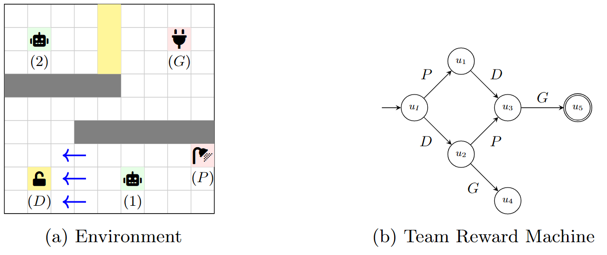

# Temporal-Causal DMARL

* [arXiv preprint](https://arxiv.org/abs/2506.07829)
* Accepted to ECML PKDD 2025

Reinforcement learning (RL) algorithms can find an optimal policy for a single agent to accomplish a particular task. However, many real-world problems require multiple agents to collaborate in order to achieve a common goal. For example, a robot executing a task in a warehouse may require the assistance of a drone to retrieve items from high shelves. In Decentralized Multi-Agent RL (DMARL), agents learn independently and then combine their policies at execution time, but often must satisfy constraints on compatibility of local policies to ensure that they can achieve the global task when combined. In this paper, we study how providing high-level symbolic knowledge to agents can help address unique challenges of this setting, such as privacy constraints, communication limitations, and performance concerns. In particular, we extend the formal tools used to check the compatibility of local policies with the team task, making decentralized training with theoretical guarantees usable in more scenarios. Furthermore, we empirically demonstrate that symbolic knowledge about the temporal evolution of events in the environment can significantly expedite the learning process in DMARL.

To reproduce the results:

1. `cd tcdmarl` (project root)
2. `scripts/run_all_experiments_paper.sh collection_name`
